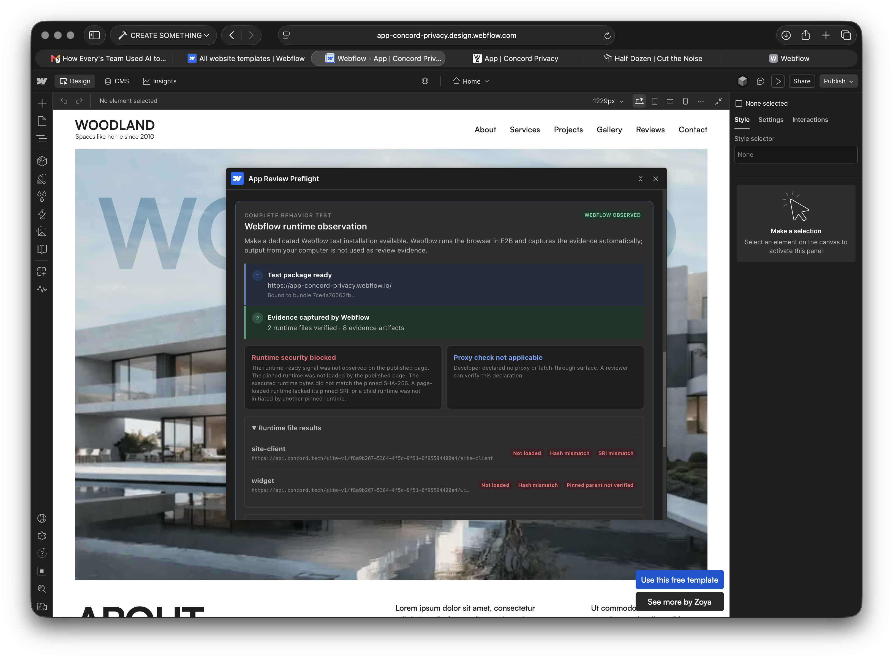

# Validate a Production Runtime

## App Review Preflight operator guide

**Audience:** Junior Webflow app developers and reviewers

**Edition:** 1.0 - July 22, 2026

**Outcome:** Produce repeatable, server-owned evidence about the JavaScript that runs on a published Webflow test site.

> App Review Preflight produces evidence. It does not approve or reject an app.

This guide teaches you how to connect one exact app bundle to one published test site, pin every JavaScript runtime file, run the site in a fresh E2B browser, and read the result without overstating what it proves.

## The five-minute mental model

Three parties take turns:

| Party | Supplies | Cannot supply |
| --- | --- | --- |
| Developer | Bundle, dedicated test site, runtime pins, run request | Trusted evidence or reviewer replay |
| Webflow runtime service | E2B browser, runtime observations, sanitized artifacts | Official approval |
| Reviewer | Independent inspection and replay request | New package values or edited evidence |

The developer benefits from a pass. That is why the developer does not control the browser that earns `webflow_observed` status. The service records what happened. A reviewer can then replay the same package without changing it.

The best move for every party is to preserve the exact package. If a bundle, URL, hash, selector, or proxy policy changes, create a new package. Never relabel old evidence.

## What a complete validation contains

A complete validation has:

1. one exact bundle and bundle SHA-256
2. one dedicated published `webflow.io` test site
3. one Runtime Test Package containing every runtime file used in the scenario
4. two completed developer observations
5. one completed reviewer replay
6. three different observation job IDs
7. the same package ID, review version, and bundle SHA across all three runs
8. `webflow_observed` evidence and verified sandbox termination for every run

The three runs may reproduce a pass, reproduce a blocker, disagree, or fail to return complete infrastructure evidence. Only the external review process can make the official decision.

## Before you start

Prepare:

- the exact zip bundle you plan to submit
- a dedicated Webflow test site with the app installed
- the site's published `https://...webflow.io` URL
- the Webflow site or installation ID
- the exact production URL for each JavaScript runtime file
- a CSS selector that appears only after the runtime is usable
- either a real proxy probe template or a declaration that no proxy surface exists

Do not use a customer site. Keep customer data, account passwords, session exports, production credentials, and license secrets out of the test package.

## Step 1: Upload the exact bundle

1. Open **App Review Preflight** in Webflow Designer.
2. Select the zip bundle you plan to submit.
3. Wait for the deterministic bundle review.
4. Read each finding before continuing.

Record the review ID, review-version ID, and bundle SHA-256. These values identify the code under test.

**Success looks like:** the runtime observation card is available and the displayed bundle SHA matches the bundle you intend to review.

## Step 2: Inventory the runtime set

A runtime can be one file or a set of files that execute together.

Start with the script loaded directly by the published page. Add another file only when that page-loaded script requests another JavaScript file during the same scenario.

For each file, record:

- exact URL
- whether the page loads it directly or another pinned runtime loads it
- SHA-256
- SRI value calculated from the same bytes

Use another Runtime Test Package for mutually exclusive variants, such as US and EU builds or free and paid plans. Every file listed in one package must load during that run.

### Choose the load mode

| What happens in the browser | Select |
| --- | --- |
| The published page contains the file's script tag | **Loaded directly by the published page** |
| Another pinned runtime creates or requests the file | **Loaded by another pinned runtime** |

A child file does not need a DOM SRI attribute. It must match its own SHA-256 and be initiated by another pinned file in the same package. An undeclared child script remains a blocker.

## Step 3: Download once and calculate the pins

Set the runtime URL and test-site URL:

```bash
export RUNTIME_URL="https://cdn.example.com/runtime/version/runtime.js"
export TEST_URL="https://your-test-site.webflow.io"

curl --fail --silent --show-error --location \
  --referer "$TEST_URL/" \
  "$RUNTIME_URL" \
  --output /tmp/reviewed-runtime.js

shasum -a 256 /tmp/reviewed-runtime.js

printf 'sha256-'
openssl dgst -sha256 -binary /tmp/reviewed-runtime.js \
  | openssl base64 -A
printf '\n'
```

The `shasum` result is a 64-character lowercase SHA-256. The second result begins with `sha256-` and is the matching Subresource Integrity value, or SRI.

Paste the SHA-256 into the extension. The extension calculates SRI automatically. If its value and the OpenSSL value disagree, stop and download the runtime again.

Repeat this process for every runtime file. Match each URL with its own outputs. A correct hash on the wrong row is still wrong.

### Check CORS before publishing browser SRI

Browser-enforced SRI for a cross-origin script requires the script response to include `Access-Control-Allow-Origin`.

```bash
curl --fail --silent --show-error --location \
  --dump-header - \
  --output /dev/null \
  --referer "$TEST_URL/" \
  "$RUNTIME_URL" \
  | grep -i '^access-control-allow-origin:'
```

If the command prints a valid header, publish the script with the calculated `integrity` value and `crossorigin="anonymous"`.

If it prints nothing, do not add those two attributes. The browser would block the runtime before it could initialize. Keep the calculated SHA-256 and SRI in the Runtime Test Package, run the observation, and expect a clear browser-SRI blocker. Ask the runtime vendor to add CORS before expecting that predicate to pass.

The distinction matters:

- the SHA-256 pin can still prove which bytes the server-owned browser received
- browser SRI cannot pass until the runtime origin supports the browser's CORS requirement

## Step 4: Add one stable readiness signal

Use a CSS selector that appears only after every required runtime file is usable. A JavaScript flag such as `window.vendor.ready` is not a CSS selector.

Example:

```html
<script>
  (() => {
    const markReady = () =>
      document.documentElement.setAttribute('data-runtime-ready', 'true');

    if (window.vendor?.ready) markReady();
    else window.addEventListener('vendor-ready', markReady, { once: true });
  })();
</script>
```

Use this selector in the package:

```text
[data-runtime-ready="true"]
```

Check it on the published page:

```js
document.querySelector('[data-runtime-ready="true"]')
```

The result must be an element. Publish the site again after changing the script or marker.

## Step 5: Declare the proxy policy

Choose **Yes** only when the app has a real proxy or fetch-through endpoint. Enter one bounded GET URL template containing `{canaryUrl}` exactly once.

Choose **No** when the app has no proxy or fetch-through surface. This is a developer declaration. The result remains visible to the reviewer and is labeled **Proxy check not applicable**. It is not observed proof that a hidden proxy does not exist.

Never use an example URL or invent a blocked response.

## Step 6: Prepare and run the package

1. Enter the published test URL and Webflow site or installation ID.
2. Enter each runtime file with the correct load mode, SHA-256, and calculated SRI.
3. Enter the readiness selector.
4. Choose the proxy policy.
5. Select **Prepare Webflow run**.
6. Confirm that the dedicated site is safe for automated testing.
7. Select **Run test now**.
8. Wait while the job is `approved`, `running`, or `uploading`.
9. Select **Check run status** until the job is complete.

Do not start another run while one is active. Two quick clicks return the same active job, not two independent observations.

## Step 7: Read the evidence

### Trust label

**Evidence captured by Webflow** and `webflow_observed` mean the service controlled the browser and evidence upload. They do not mean the app passed and do not mean Webflow approved it.

### Runtime file results

For every declared file, check:

- **Loaded** - the browser executed the file during this run
- **Hash matched** - the observed bytes matched that file's SHA-256
- **SRI matched** - a page-loaded file carried the expected DOM SRI
- **Pinned parent verified** - a child file was initiated by another pinned runtime

### Proxy result

| Label | Meaning | Next move |
| --- | --- | --- |
| **Proxy canary blocked** | The proxy refused the canary destination | Continue the replay loop |
| **Proxy canary exposed** | The proxy allowed the canary destination | Stop and fix the proxy boundary |
| **Proxy canary inconclusive** | The service could not reach a clear result | Investigate before continuing |
| **Proxy check not applicable** | The developer declared no proxy surface | Reviewer verifies the declaration |

### Blocked is different from failed

- **Runtime security blocked** is useful app evidence. The browser ran and named the predicates that did not pass.
- **Job failed** is usually a service or runner problem. Preserve the package and ask an operator to inspect the job.

Do not change app code merely to make a sandbox or upload failure disappear.

### Job state ladder

| State | Meaning | Safe action |
| --- | --- | --- |
| `approved` | The service created the observation job | Wait, then check status |
| `running` | The E2B browser is testing the published site | Wait; do not start another run |
| `uploading` | The service is checking and saving evidence | Keep waiting |
| `complete` | Trusted evidence was saved | Read the runtime and proxy results |
| `failed` | The sandbox, runner, upload, or cleanup did not finish | Preserve the package and ask an operator |

## Worked example: Concord Privacy

The first Concord observation completed with `webflow_observed` evidence, two runtime-file observations, eight evidence artifacts, and verified sandbox termination. The security result was blocked.



The evidence made two setup mistakes visible:

1. The `site-client` and `widget` hashes had been placed on the opposite rows.
2. Concord's runtime response did not include the CORS header required for browser SRI, so the published SRI attributes stopped `site-client` from loading.

Correct mapping:

| Runtime file | Load mode | SHA-256 | SRI |
| --- | --- | --- | --- |
| `site-client` | Page loaded | `3bd1f85935ed8c7920667b409ac90082aafd6465fb44182b07352ffc8b7e1968` | `sha256-O9H4WTXtjHkgZntAmskAgqr9ZGX7RBgrBzUv/It+GWg=` |
| `widget` | Child runtime | `5f476f0a20d5c650fc3d103708d50a21d1f9ac9b63ebf9e2a2c98d8995c20e4d` | `sha256-X0dvCiDVxlD8PRA3CNUKIdH5rJtj6/niosmNiZXCDk0=` |

Safe correction:

1. Remove `integrity` and `crossorigin` from the published `site-client` tag until Concord supplies CORS.
2. Keep the readiness helper and publish the test site.
3. Prepare a new package because the runtime pins changed.
4. Put each SHA-256 on the row for its own URL.
5. Keep `site-client` page-loaded, `widget` child-loaded, and the proxy policy set to **No**.
6. Run again.

The first block was valuable. It proved that the server-owned browser and evidence path worked while preventing incorrect setup from looking like a pass.

## Step 8: Repeat and replay

Run the developer test a second time with the same package. The second job ID must differ, while the package ID, review version, and bundle SHA stay the same.

Then a configured reviewer should:

1. open the same package in the reviewer workspace
2. compare the package binding with the developer observations
3. request **Run independent replay**
4. refresh until the reviewer job completes
5. record its separate job ID and result

Summarize the three-run loop as:

- `reproduced_pass` - all three runs passed the same predicates
- `reproduced_block` - all three runs reported the same blocker
- `mixed_evidence` - the runs disagree
- `infrastructure_incomplete` - one or more runs lack trusted evidence

## Troubleshooting table

| What you see | Likely cause | Safe next move |
| --- | --- | --- |
| Runtime not loaded | Script blocked, wrong URL, or page did not request it | Check the published tag, browser console, and exact URL |
| Hash mismatch | Pins are swapped, URL bytes changed, or an error body was downloaded | Download again and map each output to its URL |
| SRI mismatch | DOM SRI is missing or belongs to another file | Check CORS, then inspect the published script tag |
| Pinned parent not verified | Child file was not initiated by a declared parent | Confirm the load mode and parent-child request path |
| Ready signal not observed | Runtime never initialized or selector never appeared | Check runtime loading first, then test the selector |
| Proxy check not applicable | Developer selected **No** | Reviewer confirms the declaration |
| Job remains active | E2B is still running or uploading | Wait and select **Check run status** |
| Job failed | Sandbox, runner, upload, or cleanup problem | Preserve IDs and ask an operator to inspect the service |

## Stop and ask for help when

- you cannot prove which bundle or runtime is under test
- the bundle SHA or review version changes between runs
- an old job remains `approved`, `running`, or `uploading`
- a sandbox started but termination was not verified
- the developer and reviewer runs disagree
- the proxy canary is exposed or inconclusive
- anyone asks you to edit, upload, or relabel observed evidence
- anyone describes Preflight output as an official decision

Record the visible IDs before asking for help. Do not create extra packages or jobs to hide an unclear state.

## Validation receipt

```text
review_id:
review_version_id:
bundle_sha256:
runtime_test_package_id:
runtime_files:
developer_job_ids:
reviewer_replay_job_id:
security_results:
security_blockers:
proxy_results:
artifact_counts:
artifact_sha256s:
all_sandboxes_terminated: true | false
result: reproduced_pass | reproduced_block | mixed_evidence | infrastructure_incomplete
official_decision: null
operator:
notes:
```

## Final check

You are ready to hand off when you can answer yes to all five questions:

1. Can I identify the exact bundle and runtime files?
2. Can I explain why each runtime file uses its selected load mode?
3. Can I show two developer job IDs and one reviewer job ID for the same package?
4. Can I explain every blocker without calling it an infrastructure failure?
5. Can I state clearly that this is evidence, not an official decision?

## Brand and product references

This is an independent operator guide for App Review Preflight. Webflow and the Webflow logo are trademarks of Webflow, Inc.

- [Webflow design guidelines](https://brand.webflow.com/design-guidelines)
- [Webflow brand assets](https://brand.webflow.com/brand-assets)
